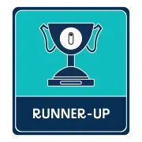
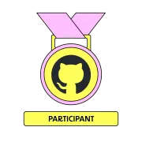
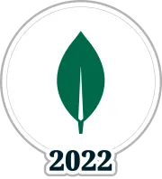

  <picture>
    <source
      srcset=".github/images/ambigram-light.png"
      media="(prefers-color-scheme: dark)"
    />
    <source
      srcset=".github/images/ambigram-dark.png"
      media="(prefers-color-scheme: light), (prefers-color-scheme: no-preference)"
    />
    
  </picture>
  
   
   
  

  
  <strong>Hello There</strong>

I'm a software engineer and open-source enthusiast from Brazil :brazil:.

I enjoy exploring creative ways to develop projects and to have fun while learning new things in the process. I also like to work on ideas and build them into solutions that can bring value.

To create high quality software, it has to mean something, be helpful, teach me something, or be fun. Otherwise, I'm just a machine, much inferior to the other ones out there.

Thanks for stopping by to read about me.

  
  <strong>Recent Contributions</strong>

- https://github.com/forem/forem/pull/20218
- https://github.com/forem/forem/pull/20187
- https://github.com/sveltejs/learn.svelte.dev/pull/479
- https://github.com/sveltejs/learn.svelte.dev/pull/478
- https://github.com/satnaing/astro-paper/pull/102

  
  <strong>Hackathons and Events</strong>

 
 

<blockquote>
  Ambigram generated at https://makeambigrams.com/  
  Event badges from https://dev.to/mateusabelli  
  SVG icons from https://primer.style/design/foundations/icons  
</blockquote>
