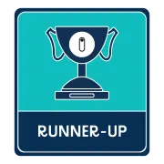
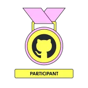
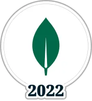

  <picture>
    <source
      srcset="assets/ambigram-light.png"
      media="(prefers-color-scheme: dark)"
    />
    <source
      srcset="assets/ambigram-dark.png"
      media="(prefers-color-scheme: light), (prefers-color-scheme: no-preference)"
    />
    
  </picture>

   
   

## About Me

I'm a Software Engineer and Open Source enthusiast from Brazil 🇧🇷.

I enjoy exploring creative ways to develop projects and to have fun while learning new things in the process. I also like to work on ideas and build them into complete solutions.

To craft high quality software, I believe that it should to be meaningful, helpful, teach something along the way, and/or just be fun to do it. Otherwise, I'd just be a machine, much inferior to the other ones out there.

## Current Stack

- **Programming Languages:** C#, TypeScript
- **Frameworks & Libraries:** ASP.NET, React, Flutter
- **Databases:** Postgres, SQLite
- **Containers & Scripts:** Docker, Python

## Interests

- **Open Source**: Contributing to [Flamenco](https://flamenco.blender.org/) — The free & open source self-hosted render farm
- **Software Engineering**: Building full-stack projects tailoring technical achievements
- **Game Dev & Art**: Playing around with Godot and tools for making small games

## Latest Contributions

- [Flamenco: Remove references of deprecated build target #104474](https://projects.blender.org/studio/flamenco/pulls/104474)
- [Flamenco: Website: Write the Flamenco Upgrading Guide #104337](https://projects.blender.org/studio/flamenco/pulls/104337)
- [Flamenco:  Addon: add dynamic tooltip on submit button when no job type is selected #104326](https://projects.blender.org/studio/flamenco/pulls/104326)
- [Flamenco: Website: Fix links in Documentation /development/database #104309](https://projects.blender.org/studio/flamenco/pulls/104309)
- [Flamenco: Sync branch magefile with main #104308](https://projects.blender.org/studio/flamenco/pulls/104308)

## Hackathons & Events

 
 

> Ambigram generated at <https://makeambigrams.com/> \
> Event badges from <https://dev.to/mateusabelli>
