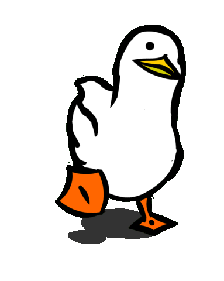

# Hello, I'm Mateus 👋

 

I'm the software engineer you're looking for, dear recruiter! 😅 
_...or at very least, that great developer who enjoys open source and a bit of creativity._

### About me

- 🛠️ Building Distributed Systems with .NET focusing on Microservices, Messaging, Testing and CI/CD
- 🌱 Contributing to [Flamenco](https://flamenco.blender.org/) - Free & Open Source Render Farm
- 🚀 Enjoying crafting polished GUI tools with GTK and TUI apps with Spectre.Console
- 📖 Fun fact: I am quite persistent when studying complex subjects.

> If you're not enjoying the process, then you're just a machine typing from a dataset. Rest is productive.

